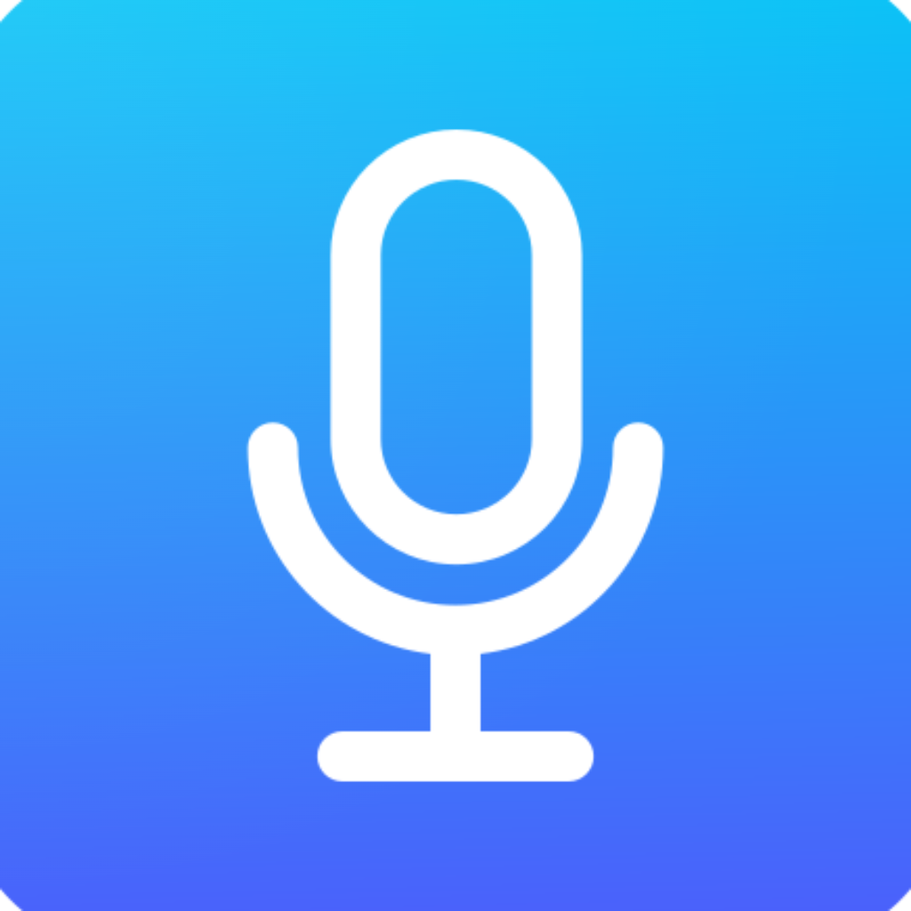
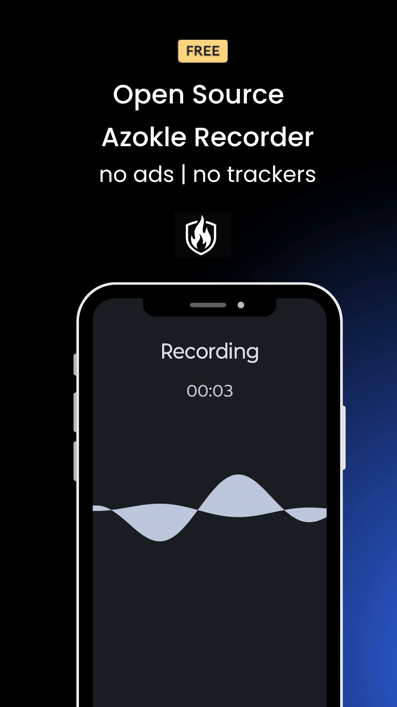
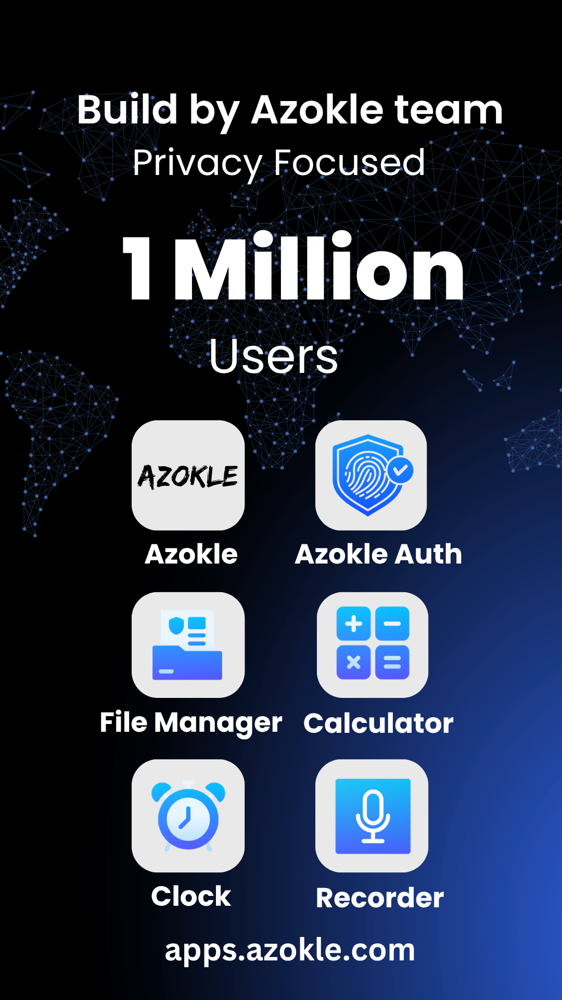
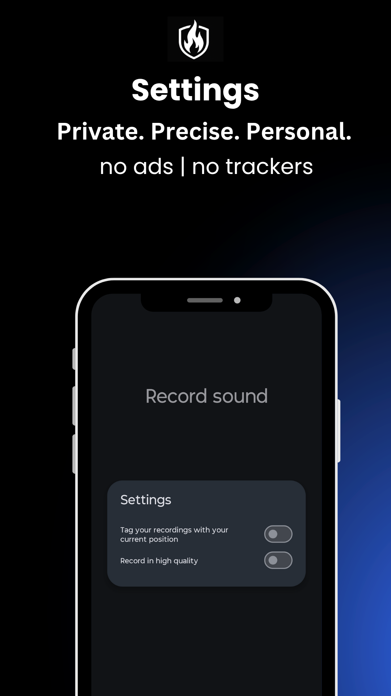
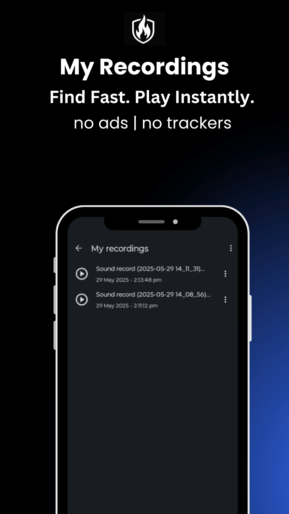

<div align="center">



# Azokle Recorder

**Privacy-first audio recorder for Android · No ads · No cloud · No tracking**

[](https://github.com/azoklesoftware/azokle-recorder-android/actions/workflows/build.yml)
[-3DDC84?logo=android&logoColor=white)](https://developer.android.com/about/versions/oreo)
[-4285F4?logo=android&logoColor=white)](https://developer.android.com/about/versions/16)
[](LICENSES/Apache-2.0.txt)
[](https://kotlinlang.org)
[](https://m3.material.io)

[**Download**](https://github.com/azoklesoftware/azokle-recorder-android/releases) · [**Report a Bug**](https://github.com/azoklesoftware/azokle-recorder-android/issues) · [**Request Feature**](https://github.com/azoklesoftware/azokle-recorder-android/issues) · [**azokle.com**](https://azokle.com)

</div>

---

## 📸 Screenshots

<div align="center">

<table>
  <tr>
    <td align="center" width="33%">
      
      <br/><sub><b>🎙️ One-tap Recording</b></sub>
    </td>
    <td align="center" width="33%">
      
      <br/><sub><b>📋 My Recordings</b></sub>
    </td>
    <td align="center" width="33%">
      
      <br/><sub><b>⚙️ Settings</b></sub>
    </td>
  </tr>
</table>



</div>

---

## ✨ Features

<table>
  <tr>
    <td>🎙️ <b>One-tap recording</b></td>
    <td>Start, pause, resume, and stop instantly. Zero friction.</td>
  </tr>
  <tr>
    <td>🌊 <b>Live waveform</b></td>
    <td>Real-time audio amplitude visualiser while recording.</td>
  </tr>
  <tr>
    <td>🎚️ <b>Dual quality modes</b></td>
    <td><b>Standard</b> — AAC/M4A (compact) &nbsp;|&nbsp; <b>High Quality</b> — WAV 44.1 kHz stereo 16-bit</td>
  </tr>
  <tr>
    <td>📍 <b>Location tagging</b></td>
    <td>Optionally tag recordings with GPS location for effortless organisation.</td>
  </tr>
  <tr>
    <td>🔔 <b>Notification controls</b></td>
    <td>Pause, resume, and stop from the notification shade — no need to open the app.</td>
  </tr>
  <tr>
    <td>📞 <b>Auto-pause on calls</b></td>
    <td>Detects incoming calls and pauses automatically to protect your privacy.</td>
  </tr>
  <tr>
    <td>📋 <b>Recordings manager</b></td>
    <td>Rename, share, play, delete — single or bulk. Clean and fast.</td>
  </tr>
  <tr>
    <td>🔒 <b>Privacy first</b></td>
    <td>No internet permission. No analytics. No ads. All recordings stay on-device.</td>
  </tr>
  <tr>
    <td>🌓 <b>Material You</b></td>
    <td>Material Design 3, edge-to-edge, auto Day/Night theme.</td>
  </tr>
  <tr>
    <td>🌐 <b>70+ languages</b></td>
    <td>Fully localised for users worldwide.</td>
  </tr>
</table>

---

## 🚀 Getting Started

### Requirements

| | |
|---|---|
| **OS** | Android 8.0+ (API 26) |
| **Target** | Android 16 (API 36) |
| **Architecture** | arm64-v8a · armeabi-v7a · x86 · x86_64 |

### Download

Grab the latest APK from the [**Releases**](https://github.com/azoklesoftware/azokle-recorder-android/releases) page, or build from source below.

### Build from Source

```bash
# Clone the repo
git clone https://github.com/azoklesoftware/azokle-recorder-android.git
cd azokle-recorder-android

# Debug build
./gradlew assembleDebug

# Release build (requires signing config — see CONTRIBUTING.md)
./gradlew assembleRelease
```

> The debug APK uses the suffix `.dev` (`org.azokle.recorder.dev`) so it can coexist with the release build.

---

## 🔐 Permissions

| Permission | Why it's needed |
|---|---|
| `RECORD_AUDIO` | Core audio capture |
| `FOREGROUND_SERVICE` | Run recorder as a foreground service |
| `FOREGROUND_SERVICE_MICROPHONE` | Android 14 microphone foreground type |
| `POST_NOTIFICATIONS` | Show recording control notification |
| `READ_PHONE_STATE` | Detect calls and auto-pause recording |
| `WAKE_LOCK` | Keep CPU awake to prevent data loss |

> 📍 Location permission is optional — requested at runtime only if you enable location tagging in Settings.

---

## 🏗️ Architecture

```
org.azokle.recorder
├── RecorderActivity          Main screen — record, pause, stop, waveform
├── ListActivity              Recordings browser — rename, share, delete
├── DialogActivity            Settings dialog
├── DeleteLastActivity        Quick-delete shortcut handler
├── RecorderApplication       Application class
│
├── service/
│   ├── SoundRecorderService  Foreground LifecycleService (Messenger IPC)
│   ├── SoundRecording        Recorder backend interface
│   ├── GoodQualityRecorder   MediaRecorder → AAC / M4A
│   └── HighQualityRecorder   AudioRecord thread → PCM → WAV
│
├── repository/               MediaStore read / write
├── viewmodels/               RecordingsViewModel (Flow-backed)
├── models/                   Recording · UiStatus
├── flow/                     ContentResolver-backed cold Flows
├── list/                     RecyclerView adapter & multi-select
├── ui/                       WaveFormView (custom amplitude view)
└── utils/                    Permissions · Location · Preferences · IPC helpers
```

**Key patterns:** Bound Service + `Messenger` IPC · Kotlin Coroutines + `StateFlow` · Material 3 edge-to-edge

---

## 🤝 Contributing

We love contributions! Please read:

- [**CONTRIBUTING.md**](CONTRIBUTING.md) — How to submit PRs, code style, commit format
- [**CODE_OF_CONDUCT.md**](CODE_OF_CONDUCT.md) — Community standards
- [**SECURITY.md**](SECURITY.md) — How to report vulnerabilities responsibly

---

## 📄 License

```
Copyright 2017–2024 The LineageOS Project
Copyright 2025 Azokle Private Limited

Licensed under the Apache License, Version 2.0 (the "License");
you may not use this file except in compliance with the License.
You may obtain a copy of the License at

    https://www.apache.org/licenses/LICENSE-2.0
```

See [**NOTICE**](NOTICE) for full third-party attribution.

---

<div align="center">

**Part of the Azokle Software suite**


[🌐 azokle.com](https://azokle.com) &nbsp;·&nbsp; [📦 GitHub](https://github.com/azoklesoftware) &nbsp;·&nbsp; [📧 hello@azokle.com](mailto:hello@azokle.com)

*Azokle Private Limited — Building software for everyone.*

</div>
